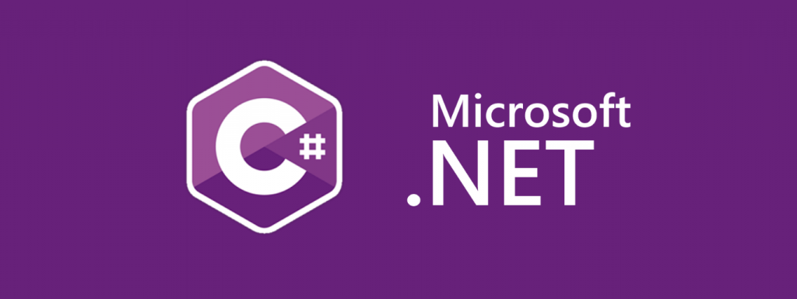

<h1 align="center">Hola, soy <a href="https://www.linkedin.com/in/javierodev/">Javier Ovalles</a> 👋</h1>

 

<h1>Acerca de mi: </h1>

<ul>
  <li>Desarrollo de aplicaciones web (HTML, CSS, JavaScript, React, Node.js, etc.)</li>
  <li>Diseño de arquitecturas de software escalables</li>
  <li>Implementación de API RESTful y GraphQL</li>
  <li>Metodologías Ágiles (Scrum, Kanban)</li>
  <li>Optimización de rendimiento y escalabilidad</li>
  <li>Trabajo colaborativo en equipos multidisciplinarios</li>  
</ul>

 

## Proyectos *bombitas*
<table>
<tr>
<td width="50%">
<h3 align="center">Proyecto de Javascript (en progreso)</h3>

  
<strong>Stack del proyecto</strong>

  

     
     
     
     
     
     
     
  

Aprende a programar aplicaciones <strong>Android con Kotlin desde cero</strong> - En este curso aprenderás todo lo necesario ya que no es necesario ningún conocimiento previo. Curso <strong>GRATUITO de 12 horas</strong> con todo el código disponible para descargar.

                                                                                      
</td>

<td width="50%">
                
<h3 align="center">Proyecto PHP (en curso)</h3>

                                       

 

Las arquitecturas son <strong>IMPRESCINDIBLES</strong> para poder trabajar como desarrollador/a Android. En este curso, divido por ramas irás aprendiendo a implementar una arquitectura real y robusta con inyección de dependencias, clean architecture, testing y mucho más.

                                                             
</table>                                                                                 

 

<table>
<tr>
<td width="50%">
<h3 align="center">Curso Android Intermedio</h3>

Aprende a programar aplicaciones <strong>Android con Kotlin nivel intermedio</strong> - En este curso nos centraremos en las <strong>buenas prácticas, arquitectura y testing</strong>. Curso <strong>GRATUITO de 8 horas</strong> con todo el código disponible para descargar.

                                                                                      
</td>       

<td width="50%">
<h3 align="center">Curso Kotlin Multiplatform</h3>

Aprende a programar aplicaciones <strong>multiplataform con Kotlin y Jetpack Compose</strong> - En este curso nos centraremos en dominar Kotlin Multiplatform <strong>desde cero</strong>. Curso <strong>GRATUITO</strong> (en desarrollo) con todo el código disponible para descargar.

                                                                                      
</td>  
</table>                                                                                 

 

<table>
<tr>
<td width="50%">
<h3 align="center">Curso Android Intermedio</h3>

Aprende a programar aplicaciones <strong>Android con Kotlin nivel intermedio</strong> - En este curso nos centraremos en las <strong>buenas prácticas, arquitectura y testing</strong>. Curso <strong>GRATUITO de 8 horas</strong> con todo el código disponible para descargar.

                                                                                      
</td>       

<td width="50%">
<h3 align="center">Curso Kotlin Multiplatform</h3>

Aprende a programar aplicaciones <strong>multiplataform con Kotlin y Jetpack Compose</strong> - En este curso nos centraremos en dominar Kotlin Multiplatform <strong>desde cero</strong>. Curso <strong>GRATUITO</strong> (en desarrollo) con todo el código disponible para descargar.

                                                                                      
</td>  
</table>                                                                                 

 

### ⚙️ &nbsp;GitHub Analytics

<!--
**javier-ovalles-ing/javier-ovalles-ing** is a ✨ _special_ ✨ repository because its `README.md` (this file) appears on your GitHub profile.

Here are some ideas to get you started:

- 🔭 I’m currently working on ...
- 🌱 I’m currently learning ...
- 👯 I’m looking to collaborate on ...
- 🤔 I’m looking for help with ...
- 💬 Ask me about ...
- 📫 How to reach me: ...
- 😄 Pronouns: ...
- ⚡ Fun fact: ...
-->
